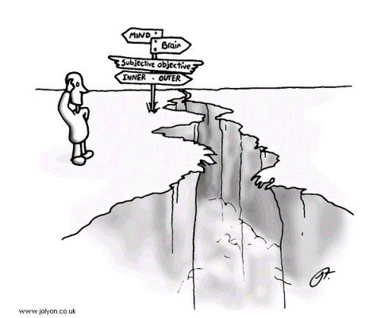
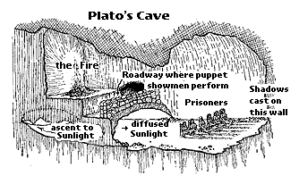

# Chapter 1. The Three Major Metaphysical Philosophies 

[[toc]]

## 1.1. The assumption of objective reality, a necessity for survival and for science? 

The assumption of an external reality is the assumption that there is a real world that is external to our mind and senses, and that it exists whether or not we as observers exist, and whether or not we are observing it. It is one we all commonly make without even thinking about it. We assume the office, and the computer in the office, are there after we leave work at the end of the day and will be there when we arrive at work in the morning. When we head home at the end of the day, we assume that our house or apartment will be there when we arrive, and that it continued to be there in our absence after we left in the morning. We assume that our friends, relatives and acquaintances are there whether we can see and talk to them or not, and whether or not we are thinking about them. We assume that our parents existed before we were born, and that many of the people we know will be alive after we die. So many of our everyday experiences repeatedly confirm this assumption that most of us hardly question it. It is an assumption that has enormous survival value: we know that a speeding car can kill us while we are crossing the street absorbed in our thoughts and unaware, that a stray bullet can instantly obliterate our consciousness without warning, or that we can die from an external agent such as a virus, bacterium or poison. 

The assumption of external reality is necessary for science to function and to flourish. For the most part, science is the discovering and explaining of the external world. Without this assumption, there would be only the thoughts and images in our own mind (which would be the only existing mind) and there would be no need of science, or anything else. 

In addition to the assumption of an external reality, we also make the assumption that this reality is objective. Objectivity means that observations, experiments or measurements by one person can be made by another person, who will obtain the same or similar results. The second person will be able to confirm that the results are the same or similar by consultation with the first person. Hence, communication is essential to objectivity. In fact, an observation that is not communicated and agreed upon is not generally accepted as a valid observation of objective reality. Because agreement is required, objective reality is sometimes called consensus reality. 

::: tip Questions
Is there any way to verify that an object exists if you are not observing it? 

If you think an unobserved object can be verified by its effects on observed objects, how can you verify that the effects come from the unobserved object?

If somebody tells you they have observed the unobserved object, how can you verify that they have? 

If you cannot verify it, why would you believe them?
:::

As we have said, science assumes that objective reality is ‘external’ to the minds that observe it. Even psychologists make this assumption in 
their study of mental functioning when they study minds other than their own. We assume that the results are objective because they can be communicated to other minds and compared. Because of this, many mental phenomena, even though they are by necessity subjective, are considered to be objective and for this reason, we consider psychology to be an objective science.

The concept of objective reality is also applied to the study of history, which is thought to be a more-or-less accurate record of past events. In order to be considered an objective part of the record, events must be agreed upon by historians. However, history is continually changing as new historical ‘facts’ appear, so history is only what we think it is at the present time. Even Napoleon is reputed to have said, 
“What is history but a fable agreed upon?”.

What about the person who observes his own thoughts, feelings and sensory experiences? In this case, the observed reality is clearly not external, but it still can be communicated and compared with similar internal observations of others, so, if there is agreement, normally we regard it to be objective. For example, there is no difficulty when we compare the mental steps that we go through while working the same math problem, or even when we compare our experiences of fear, or red, if we are responding to the same ‘external’ stimuli. If we agree that we are seeing or feeling the same thing, then we define these experiences to be objective but not external.

:::tip Question 
Is there any way of verifying that your thoughts exist if you are not observing them? 

If you believe they exist in your subconscious mind, how can you verify that?

If you cannot verify it, why would you believe it?
:::

**In fact, all observations of so-called ‘external’ reality are really observations of our own sensory experiences.** There are experiences for each of the so-called ‘external’ senses. For example, there are visual experiences, auditory experiences, tactile experiences, olfactory experiences and gustatory experiences. These experiences are all assumed to result from ‘external’ stimuli. (Here, ‘external’ means external to the senses, not necessarily external to the body. For example, if I experience pain in response to being stuck with a hypodermic needle or having been stricken by the flu, we normally assume that the pain is objective.) The mind constructs objective sources for all of these experiences, such as visible objects, audible objects, touchable objects, odiferous objects and tasteable objects.

If we now ask, “what are purely subjective experiences?”, we are led to consider experiences that are purely internal to the mind and that are not the direct result of some ‘external’ stimulus. Everyday examples of such experiences are thoughts, memories, feelings, emotions, imaginations, dreams and visions. However, many such experiences are so similar to those of other people that we can easily communicate them to others, so they have an objective quality and are hence not usually considered to be purely subjective. This type of objectivity is thus based on what so-called ‘normal’ people commonly experience. In fact, one could define ‘normality’ as the condition of having such experiences.

Now we must consider experiences that are also purely internal to the mind, but that fall outside the bounds of normality as defined above. These types of experiences we might call purely subjective since they are not easily communicated to others and hence lack both external stimulus and objectivity. Examples are hallucinations, delusions, religious and other ineffable experiences, and the experiences of awakened or self-realised minds. It is clear that our definition of subjectivity depends on our definition of normality. In fact, we shall see later that ‘normal’ minds can be really considered to be suffering from collective delusion and that all suffering, while ‘normal’, is the result of this delusion.

Does the mind function when we are not observing it? In our everyday experience, the mind will sometimes appear to work on a problem unconsciously or subconsciously, i.e. without conscious awareness, so that the solution later appears full-blown, seemingly in a flash of genius. However, this assumes that the mind is a real object that can exist outside of awareness, i.e., that it is objectively real. (Later we shall use a different definition for the mind.) Because the subconscious and unconscious minds can never be observed directly, their existence can only be an assumption.

**Because all of our experiences are necessarily subjective, we have no means to get beyond them to any kind of objective reality that might exist. Because of this, it is impossible for an objective reality to reveal itself through any observation.** Thus, the existence of an objective reality can never be proved and, even if such an objective reality existed, it could never affect any of our observations.

:::tip Question 
Is there any way of verifying that your feelings exist if you are not observing them? 

If you believe they exist subconsciously, how can you verify that? 

If you cannot, why would you believe it?
:::

While we may call it reality, external objective reality is not reality at all. An assumption that by its very nature cannot be verified is not a physical assumption, but is called a metaphysical assumption. (Such an assumption can also be called an axiom.) Thus, the bedrock of all science is not science at all but is metaphysics! Not only the nature of science, but also our experience of living, would be fundamentally changed if this assumption were not made. Later in this course, we shall discuss a teaching in which this assumption is not made and which gives us a radically different picture of ourselves and of the world.

To leap or not to leap? [Art by Jolyon](https://www.jolyon.co.uk)

## 1.2. Materialism (pure objectivity): The philosophy that all is matter, or at least, all is governed by physical law

The earliest well-articulated philosophy of materialism was that of Democritus (Greek philosopher, c. 460–c. 370 B.C.). He postulated a world made up entirely of hard, invisible particles called atoms. These atoms had shape, mass and motion, but had no other qualities, such as colour or flavour. These latter qualities were considered to be subjective and were supplied by the observer, who also was considered to be comprised of atoms.

Little further progress was made with materialist philosophy until after the Protestant Reformation, which was initiated in Germany in the 1520s by the Augustinian monk, Martin Luther (1483–1546). This stimulated such ferment that the Roman Catholic order of the time was overturned and was replaced by the new religious, political and scientific orders of the seventeenth century. Atomism was then revived in the 1640s by French scientist and Catholic priest, Pierre Gassendi (1592–1655), who sought to combine the theory with Catholic doctrine. However, beginning in the 1640s, the liberation of science from all Church authority by the philosophy of Cartesian dualism ([see next section](./#_1-3-cartesian-dualism-objectivity-plus-subjectivity-the-philosophy-that-both-matter-and-mind-are-primary-and-irreducible)) and the subsequent enormous scientific advances of the nineteenth and twentieth centuries solidified the authority of the materialists, and materialism became the dominant philosophy of the Western world.

Even those who claim to hold to philosophies other than materialism are influenced by it, perhaps in ways of which they are completely unaware. Its fundamental principle is that matter and energy are primary and all else is secondary in the sense that all else is derived from, or is an outgrowth of, matter and energy. Since the advent of quantum theory in the 1920s and its fundamental questions about the nature of matter, this philosophy has sometimes been broadened to state that physical law rather than matter and energy is primary, i.e., everything can be explained and understood in terms of physical law. This is called scientism, or scientific materialism.

Of course, this immediately begs the question, what is physical law? One could say that physical law includes all the laws of reality, in which case the question becomes meaningless. For our purposes, we shall restrict the definition of physical law to those laws recognised to be part of physics. Physics we shall understand to be the study of the fundamental laws that govern the external, objective reality that was defined in the previous section. Therefore, we shall understand materialism to be the philosophy that external, objective reality is primary, and everything else, such as all mental phenomena, are derived from, or are effects of, such reality.

The widespread belief in materialism has profound effects in our lives and in our society. If we believe this way, we must conclude that everything, including ourselves and all of life, is governed completely by physical law. Physical law is the only law governing our desires, our hopes, our ethics, our goals and our destinies. Matter and energy are our primary focus, the object of all our desires and ambitions. Specifically, this means that our lives are focused on acquiring material goods (including bodies), or at least reärranging or exchanging them, in order to produce the maximum material satisfaction and pleasure. We expend all of our energy in this quest, for there can be no other goal. And in all of this, we have no choice because we are totally governed by physical law. We may feel trapped by these beliefs and desires, but we cannot shake them. They totally dominate us.

A succinct, personalised, summary statement of materialist philosophy is, “I am a body”.

:::tip Question
Do you think that you are a body? If not, what are you?
:::

We may think that we totally disagree with this philosophy but let us think a bit more. Don’t we think that we are the servants and prisoners of our bodies; that we must do their bidding, under threat of hunger, thirst, disease and discomfort if we do not? Isn’t the welfare of our bodies our primary concern, even to the extent that it is central to our plans for our entire future or in reliving our whole past? Even if we substitute somebody else’s body for our own in the above questions, the same drives still dominate us. We are almost totally body-oriented, that is to say, matter-minded. There is little, if any, freedom in this predicament.

:::tip Question
Do you feel limited by your material needs and desires?
:::

Even the field of psychology has been influenced by materialism, the principle result being the thesis of behaviourism, which was popular during the first half of the twentieth century. This states that our behaviour is totally determined by materialistic motivations, and that consciousness and awareness have no effect on it. This thesis has been a useful premise in much psychological research, particularly with animals. It also has worked its way into the thinking of society with the result that social and economic institutions commonly attempt to modify our behaviour by offering material inducements. In fact, this type of behaviour modification actually does work to the extent that we have adopted materialistic beliefs.

A major problem of materialist philosophy is how to explain consciousness. Materialists can hardly deny the existence of consciousness because it is a universal experience. The generally accepted materialist explanation is that consciousness is an epiphenomenon, or an emergent feature, of matter. It develops when material objects reach a certain level of complexity, that of living organisms, or at least of certain types of them. However, because it is totally dependent on matter for its existence, it cannot affect or influence matter. It can only be aware of it. Matter is still primary.

A related problem is how to determine the level of complexity at which consciousness is present. If mammals are conscious, are birds? Are insects? What about amoebas and bacteria? If the ability to reproduce is the only criterion, what about self-reproducing protein molecules, like prions (the infectious agent in ‘mad cow’ disease)? If complexity is the only criterion for consciousness, what about inanimate objects? If they are included, at what level of complexity? If they are excluded, why are they excluded? Materialists have no answers to these questions.

:::tip Question
Do you think that dogs and cats are conscious? If so, what is your evidence?
:::

:::tip Question
Do you think that computers are conscious? If so, what is your evidence?
:::

:::tip Question
Do you think that bacteria are conscious? If so, what is your evidence?
:::

## 1.3. Cartesian dualism (objectivity plus subjectivity): The philosophy that both matter and mind are primary and irreducible

This philosophy was first propounded by René Descartes (French scientist and philosopher, 1596–1650) in 1641. It states that mind and matter (or the mental and the physical) are two separate and independent substances. Human beings (but not animals, according to Descartes) are composed of both substances. A mind is a conscious, thinking entity, i.e., it understands, wills, senses and imagines. A body is an object that has physical size, i.e., it exists in physical space. Minds do not have physical size (hence do not exist in physical space) and are indivisible, while bodies are infinitely divisible (in Descartes’ philosophy). Descartes initially wanted to limit his premises only to those that were indisputable; hence his famous premise “I think, therefore I am”. The ‘I’ in this statement is the mind and, since it does not exist in physical space, it can in principle survive the death of the physical body. Even though Descartes thought that mind and body existed independently of each other, he thought that mind could act on body.

The succinct, personalised, summary statement of dualism is, “I am a mind, and I have a body”.

:::tip Question
Do you agree with the preceding statement? If not, what are you?
:::

Dualism appeals to the intuition much more than does materialism. It is depressing to think, “I am a body”, but less so to think, “I have a body”. Many people have little doubt that they will survive the death of the body, at least in their hopes.

A major philosophical problem with dualism is the same as that posed by materialism. Do animals have minds? If animals are excluded, there is the problem of explaining some of their near-human behaviours. If animals are included, do we exclude any of them? What about plants and microbes? What about protein molecules and other inanimate objects? Cartesian dualism has no satisfactory answers to these questions.

Another problem with dualism is to explain the relationship between mind and matter, particularly the effect that one can have on the other. It is not difficult to see that the body affects the mind. In particular, we (meaning our minds) seem to be affected by our bodies’ health and comfort, and we certainly seem to be affected by whether or not the body is awake or asleep. Are these real effects, or are they illusion? If they are real, what is the mechanism for the body affecting the mind? Ultimately, we should be able to answer this question if the mind is physical since, in that case, it should obey physical law. If it is non-physical, then we may not ever be able to answer it using the methods of science.

The related question is, does the mind affect the body, and if so, how? This also requires knowledge of the laws obeyed by mind in order to answer fully. (We shall see that some interpretations of quantum theory state that mind manifests matter, a not insignificant effect.) The lack of satisfactory answers to all of these questions has resulted in a substantial discrediting of Cartesian dualism among philosophers.

How does the adoption of dualism as a personal philosophy affect our lives? The primary problem seems to be that it implies incomplete liberation from the limitations of the body. As long as we believe that we have a body, we will feel responsible for it, and that will ever be a source of fear. If materialism forever prevents us from being released from the body’s prison, dualism allows us to get only halfway out the door. We are still chained to the bars, with only the death of the body finally cutting the chains.

In spite of the deficiencies of dualism, Descartes succeeded in forever liberating science (the study of external, objective reality) from the dominion of Church dogma, which was based on the appeal to authority and which temporarily retained domination of the mind. From then on, science was allowed to flourish unimpeded. Science became so successful in predicting and controlling nature that scientists began to question the validity of all religious teachings. Materialism became more dominant as physical reality became better understood. Mind took a back seat and was reduced to an epiphenomenon. The Western world eagerly accepted the offerings of materialist philosophy and became intoxicated with the comforts and pleasures that it offered. It reduced mind to a tool whose main use was to ensure more and better houses and cars, more prestigious jobs and careers, and more beautiful mates and children. However, the inevitable result was the mind-stultifying hangover that now results.

## 1.4. Idealism (pure subjectivity): The philosophy that consciousness is all and all is consciousness

Idealism states that mind or consciousness constitutes the fundamental reality, or is primary. Some versions of idealism admit the independent existence of material objects, others deny that material objects exist independently of human perception.

Anaximander (Greek philosopher, c. 611–c. 547 B.C.) may have been the first idealist philosopher. Only one fragment of his writing has been preserved but he seems to have thought that the original and primary substance (which could be consciousness) is a boundless something from which all things arise and to which they all return. He was struck by the fact that the world presents us with a series of opposites, of which the most primary are hot and cold, wet and dry. He thought of these opposites as being ‘separated out’ from a substance which was originally undifferentiated.

Plato (Greek philosopher, c. 428–c. 348 B.C.) is often considered the first idealist philosopher, chiefly because of his metaphysical doctrine of Forms. Plato considered the universal Idea or Form, sometimes called an archetype — for example, redness or goodness — to be more real than a particular expression of the form — a red object or a good deed. According to Plato, the world of changing experience is unreal, and the Idea or Form — which does not change and which can be known only by reason — constitutes true reality. Plato did not recognise mystical experience as a route to true reality, only reason.

Idealism was first expounded by Plato in his cave allegory in *The Republic* (c. 360 B.C.).^[see, e.g., Julia Annas, *An Introduction to Plato’s Republic*, 1981, page 252] The cave is a metaphor for the mind. Prisoners are in an underground cave with a fire behind them, bound so they can see only the shadows on the wall in front of them, cast by puppets manipulated behind them. They think that this is all there is to see; if released from their bonds and forced to turn around to the fire and the puppets, they become bewildered and are happier left in their original state. They are even angry with anyone who tries to tell them how pitiful their position is. Only a few can bear to realise that the shadows are only shadows cast by the puppets; and they begin the journey of liberation that leads past the fire and right out of the cave into the real world. At first they are dazzled there, and can bear to see real objects only in reflection and indirectly, but then they can look at them directly in the light of the sun, and can even look at the sun itself.

This allegory is related to idealism in the following way. The cave is the mind. The shadows of the puppets that the prisoners are watching represent their taking over, in unreflective fashion, the second-hand opinions and beliefs that are given to them by parents, society and religion. The puppets themselves represent the mechanical, unreasoning minds of the prisoners. The light of the fire within the cave provides only partial, distorted illumination from the imprisoned intellects. Liberation begins when the few who turn around get up and go out of the cave. Outside of the cave, the real objects (the Forms) are those in the transcendental realm. In order to see them, the light of the sun, which represents pure reason, is necessary. A similar allegory using today’s symbols would replace the cave with a movie theatre, the shadows with the pictures on the screen, the puppets with the film, and the fire with the projector light. The sun is outside, and we must leave the theatre to see its light (we must leave the mind).

The next major idealist philosopher was Plotinus (204/5–270 A.D.), who is generally regarded as the founder of Neoplatonism. He was one of the most influential philosophers in antiquity after Plato and Aristotle (who was primarily a philosopher of politics, ethics and nature). The term ‘Neoplatonism’ is an invention of early nineteenth century philosophers and was intended to indicate that Plotinus initiated a new phase in the development of the Platonic tradition. The (greatly simplified) basic principles of Neoplatonism are: 

1. The One (non-dual Reality), which is the first principle of all. It is both self-caused and the cause of all dualistic concepts. 
2. Intellect, which works with dualistic concepts that are derived from Plato’s Forms. 
3. Soul, which is the principle of desire for external objects. 

These principles are both ultimate ontological realities and explanatory principles.

The eighteenth century British philosopher George Berkeley (1685–1753) was one of the major exponents of idealism. He denied the existence of material substance (calling his philosophy immaterialism), and held that the universe consists of God, which is the infinite spirit; of finite spirits including human beings; of ideas that exist only in the minds of spirits; and of nothing else. According to Berkeley, spirits are able to perceive ideas but ideas are inert, without any power to perceive. His most characteristic philosophical doctrine is summarised in the expression “to be is to be perceived”. In other words, to say that a material object exists is to say that the idea of it is perceived by a spirit. Since Berkeley assumed that material objects exist without human spirits to perceive them, the mind that perceives them must be divine rather than human.

The German philosopher Immanuel Kant (1724–1804) expounded a form of idealism that he called transcendental idealism. He believed that there is a reality that is independent of human minds (the noümenon, or thing-in-itself), but that is forever unknowable to us. All of our experience, including the experience of our empirical selves (the phenomenon, or thing-as-it-appears), depends on the activity of a transcendental self, also of which we can know nothing.

Georg Wilhelm Friedrich Hegel, also a German philosopher (1770–1831), built on the idealist philosophy of Kant, and called his system absolute idealism. He believed that reality is Absolute Mind, Reason or Spirit. Absolute Mind is universal, while each individual mind is an aspect of it, as is the consciousness and rational activity of each person. Absolute Mind continually develops itself in its quest for its own unification and actualisation. For this purpose, it manifests itself as the subjective consciousness of the individual, who undergoes a rational process of development from a purely materialistic and self-centred state to a universal and rational consciousness. In this process, the individual passes through several phases — family, society, state — each of which represents a move from individualism to unity. Human history in general is the progressive movement from bondage to freedom. Such freedom is achieved only as the separate desires of the individual are overcome and integrated into the unified system of the state, in which the will of the individual is replaced by the will of all.

The forms of idealism described above were all formulated by Western philosophers, who almost exclusively depended on rational thought to develop their philosophies. They scarcely took account of the many forms of Eastern philosophy, which are heavily dependent on mystical experience. Furthermore, there was very little recognition of the theories and knowledge that science was developing from the seventeenth century on.

:::tip Questions 
If everything is consciousness, whose consciousness is it? 
Is there more than one consciousness? If so, what defines a consciousness?  
If there is more than one consciousness, how do different consciousnesses communicate? 
:::

*Solipsism* is a form of idealistic philosophy that states that nothing exists that you yourself are not observing. On the other hand, non-solipsistic idealistic philosophy states that nothing exists unless it is being observed by any conscious observer. Because these are idealistic philosophies, there is no objective reality in either of them. A flaw in both of these views is the assumption that the observer itself is an objective entity ([see Section 1.1](./#_1-1-the-assumption-of-objective-reality-a-necessity-for-survival-and-for-science)). But if there is no objective reality, neither can there be an objective observer.

For our purposes in this section, we shall consider a version of idealism, called monistic idealism, which states that Consciousness and only Consciousness is fundamental and primary. Everything, including all matter and every mind, exists within Consciousness. From this point of view, matter is an emergent feature, or epiphenomenon, of Consciousness, rather than the reverse as in materialism. There are perplexing paradoxes in quantum theory that result from a materialist or a dualist philosophy but that do not arise in an idealistic philosophy.

In this philosophy, Consciousness is Awareness (Noümenon) together with all of the objects of Awareness (phenomenon). The impersonalised, summary statement of monistic idealism is, “I am Consciousness”. We shall see later that all objects of Awareness are really Awareness in disguise. Hence, “I am Consciousness” translates to “I am Awareness”.

:::tip Question
Do you agree with the preceding statement? If not, what are you?
:::

This suggests that, in order to realise that we are Awareness, we must first look inward, away from all phenomenal objects. Awareness is not an object and therefore cannot be described conceptually or perceived as an object. My true nature as Awareness can be realised only by looking away from both the conceptual and the perceptual. After we realise this, we will be able to see that Awareness is All that is.

We can adapt Plato’s cave allegory to represent monistic idealism in the following way. The fire is replaced by the light of the sun (pure Awareness) coming in through the entrance to the cave, and the puppets are replaced by archetypal objects within the transcendent realm. The phenomenal world of matter and thoughts is merely the shadow of the archetypes in the light of consciousness. Here, we clearly see a complementarity of Phenomenon and Noümenon. To look only at the shadows is to be unaware of Awareness. To be directly aware of Awareness is to realise that the phenomenal world is merely a shadow. The shadow world is what we perceive. Awareness can only be apperceived, i.e., realised by a knowing that is beyond perception. Apperception liberates one from the shackles of the cave, and exposes one to unlimited freedom. 
Apperception is the verification that consciousness is all there is.

## 1.5. The teaching of non-duality

So far, we have been discussing metaphysical philosophies without really defining what we mean by metaphysical philosophy. A metaphysical philosophy is a purely conceptual structure that is presumed to be a logically self-consistent description of some aspect of reality. It does not necessarily include techniques for experiencing this reality. A philosophy is different from what we shall call a teaching. The purpose of a teaching is to help a student to know a reality, whether it is phenomenal or noumenal. Since the emphasis is on knowing rather than on logic, a teaching may use whatever concepts and techniques work in bringing the student to the desired state of knowing. A teaching often will have a philosophical basis, but there is no particular requirement to adhere rigidly to it.

Closely related to the philosophy of monistic idealism is the teaching of non-duality (in Sanskrit called *Advaita*). Non-duality as a coherent teaching was first formulated by Sankara (c. 788–820)^[[The Advaita Vedânta Home Page — Sankara’s Life](https://www.advaita-vedanta.org/avhp/sankara-life.html)] a philosopher and theologian born in Kerala in southern India. A Hindu ascetic who lived for only 32 years, he interpreted the *Vedanta* monistically, and ascribed all reality to a single unitary source that he identified as *Brahman*. In this, he declared all plurality and differentiation to be nothing but an illusion.

:::details Note
*Vedanta* is one of the six orthodox systems of Indian philosophy, and the one that forms the basis of most modern schools of Hindu philosophy. The term *Vedanta* means the ‘conclusion’ of the *Vedas*, which comprise the earliest sacred literature of India. The three fundamental *Vedanta* texts are the *Upanishads*; the *Brahma-Sutras*, which are very brief, even one-word interpretations of the doctrine of the *Upanishads*; and the famous poetic dialogue, the *Bhagavad-gita* (‘Song of the Lord’), which, because of its immense popularity, Sankara drew upon for support of the doctrines found in the *Upanishads*.
:::

Sankara’s formulation of non-duality was written in Sanskrit, and contained many references to Hindu culture and religion. In addition to the difficulty of accurately translating it into English, there is the problem of separating its core teaching from everything else. Therefore, in this course, we shall rely only on modern teachers of non-duality, especially those who write and speak in English and direct their teaching at Western audiences.

Non-duality is a teaching, not a philosophy, because it uses many methods of pointing the mind away from the conceptual and towards the non-conceptual. Awareness cannot be described — it must be known directly without the intermediary of concepts. The teaching of non-duality, while it uses concepts, is really a pointer to the truth that our true nature is Awareness. Our discussion of quantum theory and consciousness in Part 1 of this course is necessarily philosophical because, like all of science, it deals strictly with concepts. However, in [Part 2](/part-2-metaphysics-non-duality/) and [Part 3](/part-3-end-suffering-discovery-true-nature/) we depart from philosophy and study instead the teaching of non-duality.

As paradoxical as it might seem, *Advaita* is more ‘scientific’ than is the materialistic premise of an objective, external world because it is based on the immediate and direct experience of our consciousness, rather than on a metaphysical concept. The concept of an external world is not primary, but is a mental construct based on sense impressions and therefore, like all concepts, it must be taught and learned, while the self-evident experience of consciousness is preconceptual and cannot be denied.

## 1.6. The distinction between Consciousness, Awareness and mind

Here, we must say what distinction we shall make between mind and consciousness. Many writers use ‘mind’ when other writers use ‘consciousness’ to describe the same thing. In Chapters 1 through 8, we shall use the word ‘consciousness’ (uncapitalised) rather ambiguously to mean either mind or the general principle of consciousness. This reflects the ambiguity of common usage. Beginning in [Chapter 9](/chapter-9-perceiving-conceptualising/), we shall be more precise and shall start referring to ‘Consciousness’ (capitalised) as All-That-Is. This includes Noümenon (the Unmanifest) and phenomenon (the manifest). When we speak of our experience, we shall often refer to Noümenon as Awareness, and to phenomenon as mind. Then the word ‘mind’ will mean only the **experience** of the mental, sensory and perceptual functioning of the individual organism, not to any kind of physical object such as the brain. The combination of body and mind we shall refer to as the body–mind organism. After Chapter 9, we shall not use ‘consciousness’ (uncapitalised) unless we are following the usage of other writers.

:::tip Exercise
Whenever you can think of it, ask, “What is it that does not change no matter what I am doing or what is happening?”. Then look and see. The purpose of the question is to focus your attention. The answer comes when you look and see.
:::

:::tip Exercise
Consider the inquiry, “who/what am I?”. Look and see if you are a thought, image, feeling, emotion, sensation or some combination of these. If you think you are, look and see what it is that thinks so.
:::

## 1.7. What is Reality not?

We shall see that, according to the teaching of non-duality, Reality is not: 
 1. What you have been told it is. 
 2. What you think it is. 
 3. What you believe it to be. 
 4. What you want it to be. 
 5. What you think it should be.

Well, then, what **is** It?

We shall see that the only way to find out is to look and see for yourself, not to believe. In fact, **this is a course in seeing, not in believing**.

---

#### Footnotes