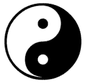
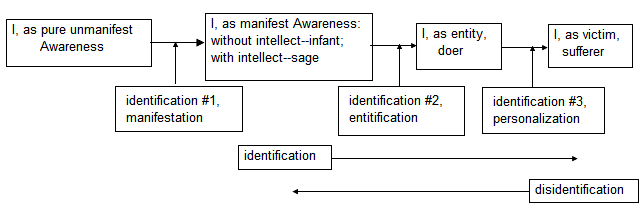

# Chapter 11. The Functioning of the Mind

[[toc]]

## 11.1 The nature of duality

In the meditation for May 21 in *A Net of Jewels* (1996), Ramesh says:

>It must be constantly borne in mind while trying to understand the mechanics of the apparent process of manifestation that nothing has actually been created. All that appears is mind-stuff, that of which all dreams are made, and apart from Consciousness itself, nothing exists, neither the mind nor the senses nor their objects.

In the meditation for May 20, he says:

>In one’s natural, immediate attention or awareness there are no boundaries, no separate items of manifestation, unless and until thought intrudes and directs specific concentration on a particular thing. And this is what creates separation along with the whole chain of other thoughts and reäctions that lead to every kind of conflict and unhappiness, which we then interpret as bondage. But the realisation that boundaries are a product of thought is at once the realisation that the separation caused by these boundaries and the conflicts that ensue are all an illusion.

In the meditation for October 29, he says:

>The entire manifestation is purely conceptual. Nothing has actually ever been created, and nothing has ever been destroyed.

On page 42 of *The Elements of Buddhism* (1990), John Snelling says:

A primary cause of suffering is delusion: our inability, because of subtly willful blindness, to see things the way they truly are but instead in a distorted way. The world is in fact a seamless and dynamic unity, a single living organism that is constantly undergoing change. Our minds, however, chop it up into separate, static bits and pieces, which we then try mentally and physically to manipulate. One of the mind’s most dear creations is the idea of the person and, closest to home, of a very special person which each one of us calls ‘I’: a separate, enduring ego or self. There is ‘I’ — and there is all the rest. That means conflict — and pain, for ‘I’ cannot control that fathomless vastness against which it is set. It will try, of course, as a flea might pit itself against an elephant, but it is a vain enterprise.

In this chapter, we shall depart from the trend of Chapters 9 and 10 by focusing our attention on the world instead of on what we really are. However, it will be helpful for the reader to keep in mind the lesson of those chapters, viz., that there is nothing but Consciousness. Everything else is a concept. But, in order to continue our course, we must attempt to conceptualise that which cannot be conceptualised.

In [Section 8.2](/chapter-8-transcendental-realms/#_8-2-the-meaning-of-the-transcendental-realms), we saw that the conventional concept of objective reality rests on shaky grounds. In [Section 9.2](/chapter-9-perceiving-conceptualising/#_9-2-what-is-the-perceived), we saw that all separation between objects is purely conceptual because there is no separation within the wholeness of Consciousness. Likewise, we saw in [Section 9.3](/chapter-9-perceiving-conceptualising/#_9-3-what-is-the-perceiver) that the separation between pure Subjectivity (Awareness) and pure objectivity is also purely conceptual. These are examples of the way we shall use concepts to point to what is beyond concepts.

Since concepts are formed by splitting off one part of the whole from the rest, they invariably come in the form of polar pairs, that is, of pairs of inseparable opposites (e.g., ‘I’ and not-‘I’). A pair forms an indivisible whole. Thus, the two opposites must always appear together, and are conceived from what is inconceivable. Since wholeness appears to have been broken, non-duality appears to have been replaced by duality. However, this is only an appearance, a result of conceptualisation, since Consciousness is always intrinsically whole.

The appearance of duality implies a boundary line between one part and its opposite. As we shall soon see, one of the inevitable consequences of any boundary line is its potential to become a battle line, with all of the suffering that it entails.

All polar pairs, or dualities, are only conceptualisations in mind, and come and go in mind without affecting Consciousness, just as a reflection can come and go without affecting its source. All conceptual phenomena are merely reflections of Consciousness in Consciousness (the metaphor of [Section 13.9](/chapter-13-some-useful-metaphors/#_13-9-the-dust-in-a-light-beam)). They are the restless waves that appear on the silent sea (the metaphor of [Section 13.4](/chapter-13-some-useful-metaphors/#_13-4-the-shadow)).

The yin–yang symbol of ancient Chinese philosophy^[see, e.g., [Yin and yang - Wikipedia](https://en.wikipedia.org/wiki/Yin_and_yang)] shown below (except for the captions) is a striking representation of duality within non-duality. It graphically shows how non-duality (the outer circle) appears to be broken into the two polar opposites, yin (dark) and yang (light). Each part contains the seed (a small dot) of the other part, representing the ease with which yin–yang can change into yang–yin. The boundary line between the two represents potential conflict, while non-duality itself is never disturbed by any appearances within it. In Chinese philosophy, yin signifies the female (moon) principle, and yang signifies the male (sun) principle, but, more generally, they represent any pair of polar opposites.

*All is Consciousness*

## 11.2. The appearance of sentience within Consciousness

We have seen two objective explanations of how the world appears out of the transcendental: 1) wave-function collapse, given in [Section 7.3](/chapter-7-summary-critique-amit-goswami-interpretation-quantum-theory-within-monistic-idealism/#_7-3-the-world-in-idealism); and 2) manifestation from the transcendental realms of Nisargadatta and Ramesh, given in [Section 8.1](/chapter-8-transcendental-realms/#_8-1-similarities-between-the-different-transcendental-realms). Both concepts have the logical difficulties that are discussed in [Section 8.2](/chapter-8-transcendental-realms/#_8-2-the-meaning-of-the-transcendental-realms). A simpler, more general, and more verifiable concept is that the manifestation simply appears when sentience appears within Consciousness.

Sentience is the mechanism by which Consciousness becomes aware of Itself. (Objectively, sentience requires a brain connected to sensory organs; see [Section 7.6](/chapter-7-summary-critique-amit-goswami-interpretation-quantum-theory-within-monistic-idealism/#_7-6-the-first-identification-the-appearance-of-sentience).) There can be no manifestation without sentience, and there can be no sentience without manifestation.

In [Chapter 9](/chapter-9-perceiving-conceptualising/), we used the term individual mind, although we found that Awareness of all minds is universal, not individual. In simplest conceptual terms, all experience can be divided into thoughts, feelings (which are more subtle than emotions), emotions, sensations and perceptions. All of these are nothing but concepts dividing Consciousness, so none is more real than another. However, we tend to equate intensity and persistence with reality, so the last items in the list can seem to be more real than the first items. For example, emotions, sensations and perceptions can seem to be more real than feelings and thoughts because they can be more intense and persistent. However, sensations and perceptions are not inherently more real than feelings and thoughts are. On the contrary, the more attention-grabbing an object is, the more unreal it is likely to be, and the more subtle it is, the more real it is likely to be. For example, subtle feelings and thoughts (see [Section 10.1](/chapter-10-teaching-non-duality/#_10-1-the-metaphysics-of-non-duality), [Chapter 16](/chapter-16-love-seeking-itself/)) are more likely to point to Reality than intense ones are, and very subtle perception (called apperception) is more likely to reveal the underlying Reality of the object (see [Section 23.3](/chapter-23-disidentification-through-inquiry/#_23-3-inquiry-into-the-self-self-inquiry) and [Chapter 24](/chapter-24-disidentification-through-meditation/)) than superficial perception is.

In chapter 25 of *I Am That* (1984), Nisargadatta Maharaj says:

>What is beautiful? Whatever is perceived blissfully is beautiful. Bliss is the essence of beauty.

On pages 48–49 of his book *Eternity Now* (1996, see Appendix), the sage, Francis Lucille, says that Truth, Love and Beauty transcend all concepts, and come directly from the Unmanifest and are pointers to the Unmanifest. On page 70, he says that positive feelings like love, happiness, gratitude, awe, respect and sense of beauty come from beyond the mind, and they generate release, relief and relaxation at the somatic level. These are to be contrasted with negative emotions, like anger, hatred and fear, which come from the mind, and which generate stress, heaviness, pressure, constriction and tension at the somatic level.

:::tip Exercise
Close your eyes and feel the following feelings:  
• Fear, anger, hatred.

Now feel the following feelings:  
• Love, gratitude, beauty.

What were your experiences? Where did you feel them? Which seemed more real?
:::

## 11.3. Manifestation: The first level of identification

We shall talk about three levels of identification. The appearance of sentience and the manifestation is the **first level of identification** (see [Section 7.6](/chapter-7-summary-critique-amit-goswami-interpretation-quantum-theory-within-monistic-idealism/#_7-6-the-first-identification-the-appearance-of-sentience)).

In the meditation for January 12 in *A Net of Jewels* (1996), Ramesh says:

>The entire phenomenal manifestation is based on the principle of duality, which starts with the sense ‘I AM’.

In the meditation for June 9, he says:

>An infant, not being aware of having an individual identity, has no intellect with which to conceptualise and therefore lives in spontaneous freedom without resistance from moment to moment. The same is true of the self-realised sage, who has gone beyond the mind.

And in the meditation for April 10, he says:

>The life of a sage appears to others to be as purposeless as the actions of an infant. The infant lives in the bliss of ignorance, while the self-realised sage lives in the bliss beyond both ignorance and knowledge. In fact the sage is no longer even an individual, in spite of the presence of a fully developed intellect.

At the first level of identification, which is the level of the infant, Consciousness is identified with the whole because the concept of separation has not yet arisen. Until intellect arises, there can be no concepts, so there can be no distinction made between subjectivity and objectivity. (This might also be the case with insects and the lower animals.) With the appearance of intellect in man and possibly the higher animals, the concepts of separation and duality appear. These concepts appear within non-duality, e.g., the concept of the individual mind (see [Section 9.2](/chapter-9-perceiving-conceptualising/#_9-2-what-is-the-perceived)) appears within Consciousness. The working mind now appears (see [Section 11.9](/chapter-11-functioning-mind/#_11-9-the-thinking-mind-and-the-working-mind)) but still with no sense of personal doërship. This is the state of the sage. The difference between the sage and the infant is that the sage has a well-developed intellect whereas the infant does not.

:::tip Question
Does the manifestation (the first level of identification) occur only in the infant? Does it also exist in the adult on waking from deep sleep? If observations occur many times per second (see [Section 6.3](/chapter-6-what-does-quantum-theory-mean/#_6-3-the-copenhagen-interpretation-a-partly-objective-and-partly-subjective-interpretation), [Section 6.4](/chapter-6-what-does-quantum-theory-mean/#_6-4-what-can-make-an-observation-in-the-copenhagen-interpretation), [Section 7.2](/chapter-7-summary-critique-amit-goswami-interpretation-quantum-theory-within-monistic-idealism/#_7-2-schrodingers-cat-revisited)), might it also occur at each observation?
:::

In the sage, as distinct from ordinary people, there is no identification with the concepts of doërship. However, in the sage as well as with ordinary people, there is identification with name and form. This means that there is direct awareness of the body’s thoughts, feelings, emotions, sensations and perceptions, but there is no direct awareness of those of any other body (see [Section 9.2](/chapter-9-perceiving-conceptualising/#_9-2-what-is-the-perceived)). Thus, when the sage says “I”, he often refers to ‘his’ body–mind but never to another body–mind. (At other times, when the sage says “I”, he often refers to Consciousness.) Ramesh says that identification with name and form is exhibited when the sage is addressed and the body responds. In the *Advaita Fellowship News* of August 2003,^[[Advaita Fellowship](https://www.advaita.org)] he says:

>The really important thing to realise — there is no need to try to remember it — is that the fact that there is no individual doër does not mean that there is no doing, that there is inaction, but that the operation of doing happens in the form not of inaction but non-action. The ego — as identification with a name and form — will remain as long as the body remains, but after Self-realisation, continues to function merely as a witness of the non-doing instead of as a doër.

:::details note
In this passage, Ramesh uses the term ‘ego’ to mean both identification with name and form after Self-realisation, and identification with doërship, name and form before Self-realisation. In this course, we shall use it only in the latter sense.
:::

Because the sage functions from pure Awareness, when the sage speaks, it comes directly from Source without being corrupted by a ‘me’. However, what the sage says and the way it is said also depends on the conditioning of the body–mind organism, and this persists after the disappearance of the ‘me’. That is why different sages will explain their experiences of non-duality in different terms.

## 11.4 Objectification: The second level of identification

In the meditation for July 31 in *A Net of Jewels* (1996), Ramesh says:

>Bondage is nothing more than the illusion that you are an autonomous entity.

The concept of the separate ‘I’ appears in the child after the appearance of the intellect, and after there is sufficient conditioning in the body–mind organism (see [Section 5.8](/chapter-5-conscious-mind-free-will/#_5-8-when-and-how-does-a-child-begin-to-perceive-objects)). Awareness then identifies with this ‘I’ concept (**the second level of identification**) to produce the sense of **personal doërship and choice**, and the fictitious ‘me’, ego, or individual (see, e.g., [Section 7.6](/chapter-7-summary-critique-amit-goswami-interpretation-quantum-theory-within-monistic-idealism/#_7-6-the-first-identification-the-appearance-of-sentience), [Section 7.7](/chapter-7-summary-critique-amit-goswami-interpretation-quantum-theory-within-monistic-idealism/#_7-7-the-second-identification-the-appearance-of-the-i), [Section 7.8](/chapter-7-summary-critique-amit-goswami-interpretation-quantum-theory-within-monistic-idealism/#_7-8-further-discussion-of-the-unconditioned-self-the-ego-and-freedom)). Now there is **objectification** (which we may also call **entityfication**) as well as conceptualisation; or **dualism** (which includes the sense of separation) as well as duality (which is purely conceptual, see [Section 9.5](/chapter-9-perceiving-conceptualising/#_9-5-objectification-the-body-mind-organism-and-the-primacy-of-the-concept-of-memory)).

Whenever there is the sense of personal doërship, there is also suffering because, in addition to the mind functioning as the working mind, it also functions as the thinking mind (see [Section 11.9](/chapter-11-functioning-mind/#_11-9-the-thinking-mind-and-the-working-mind)). The sage does not suffer even though there may be pain because there is no sense of personal doërship that results in resistance and clinging, and no thinking mind (see [Chapter 22](/chapter-22-disidentification-from-attachment-aversion/)).

When an object is said to exist, what do we mean? It means that Awareness has identified with the ‘I’-concept, resulting in the belief that the ‘I’ is separate from the rest of the manifestation. Thus, the ‘me’ is said to **exist**. From this, we can see that **existence is conceptualisation plus identification**. After Awareness identifies with the ‘I’-concept, the pernicious beliefs in the existence of other objects also arise. Objects seem real because they seem to exist independently of each other and of our awareness of them. However, independent existence is nothing but a product of conceptualisation, identification and belief. In Reality there exists no ‘me’ or any other kind of object. There is only Consciousness.

:::tip Exercise
Do the following exercise with your eyes closed while looking past your thoughts directly at the sensations themselves. What is your immediate non-conceptual experience of the following:
 1. There are sounds, but is there something making the sounds? 
 2. There are sensations of touch and pressure, but is there something causing the sensations?
:::

:::details Note
Sometimes we might carelessly say that Consciousness exists, but as we have already seen, Consciousness includes all existence and non-existence, and transcends both existence and non-existence (see [Section 10.1](/chapter-10-teaching-non-duality/#_10-1-the-metaphysics-of-non-duality)). Another type of confusion results when the word existence is used to refer to the pure sense of Presence that always accompanies pure Awareness whenever manifestation is present. This might be called pure Existence, but we shall avoid using this terminology.
:::

Everyone can say the following: “I am not an individual, and I am not limited”. As pure Awareness, I am unlimited Reality. Reality is the same whether the eyes are open or closed. When the eyes are closed and all thoughts and images are absent, I am the only Reality. When the eyes are open, and objects seem to be present, I am still the only Reality. Reality underlies and pervades all the objects that I perceive. That is why I am everything and everything is Me.

On page 43 of *The Elements of Buddhism* (1990), John Snelling says:

Central to the Buddha’s teaching is the doctrine of *anatman*: ‘not-self’. This does not deny that the notion of an ‘I’ works in the everyday world. In fact, we need a solid, stable ego to function in society. However, ‘I’ is not real in an ultimate sense. It is a ‘name’: a fictional construct that bears no correspondence to what is really the case. Because of this disjunction all kinds of problems ensue. Once our minds have constructed the notion of ‘I’, it becomes our central reference point. We attach to it and identify with it totally. We attempt to advance what appears to be its interests, to defend it against real or apparent threats and menaces. And we look for ego-affirmation at every turn: confirmation that we exist and are valued. The Gordian Knot of preoccupations arising from all this absorbs us exclusively, at times to the point of obsession. This is, however, a narrow and constricted way of being. Though we cannot see it when caught in the convolutions of ego, there is something in us that is larger and deeper: a wholly other way of being.

On page 64 of *Nuggets of Wisdom* (2005) by Ramesh Balsekar, he says:

>The total acceptance of non-doërship means the end of the load of guilt and shame for one’s own actions and the load of hatred and malice towards the other for his actions. The removal of the load means the automatic presence of peace and harmony — equanimity.

On page 65, he says:

>There is a distinct difference between the anger, grief or fear of the sage and that of an ordinary person. The sage’s emotion is not based on any selfish motivation; and the sage’s emotion is always in the present moment, and therefore very short-lived. No residual impression remains in the mind that could lead to involvement in horizontal time.

The beliefs in the existence of the ‘me’ and of the world are more persistent than they would be if they were known to be purely conceptual. Since the mind consists not only of thoughts, but also of feelings, emotions, sensations and perceptions, identification and belief can percolate down to these other levels, too. In particular, the emotions of guilt, shame, hatred, malice, envy, jealousy, pride and arrogance are compelling evidence for a continuing identification with, and belief in, the ‘me’. Upon awakening, these emotions disappear. Other emotions may arise, but there is no identification with them, so they quickly disappear without causing suffering. In particular, when a sage exhibits anger, it passes quickly without lingering because there is no identification with it.

:::tip Question
How does the sense of personal doërship lead to suffering?
:::

:::tip Question
How do the following emotions depend on the sense of personal doërship? Guilt, shame, hatred, envy, jealousy, pride.
:::

Belief in separation is extremely persistent, and is virtually invulnerable to superficial mental practices, such as the mechanical repetition of aphorisms, affirmations or denials. For example, the thought that ‘I’ exist as an individual is not nearly as difficult to see through as the feeling that ‘I’ exist. Therefore, in order for a practice to be effective, it must be seen and felt directly that there is no ‘me’ and there is no separation. Such practices are the subjects of [Chapter 20](/chapter-20-understanding-direct-seeing/), [Chapter 22](/chapter-22-disidentification-from-attachment-aversion/), [Chapter 23](/chapter-23-disidentification-through-inquiry/), [Chapter 24](/chapter-24-disidentification-through-meditation/).

It is the appearance of the conceptual, dualistic individual that is the source of all conflict, suffering and striving in the world. However, the individual is an illusion because the apparently individual awareness is actually still pure Awareness. There is always only one Awareness, never multiple awarenesses. The individual is only a conceptual object because its subjectivity is really pure Subjectivity.

When the ‘me’ seems to appear, a boundary seems to arise between itself and everything else. This is represented in [Figure 1 of Chapter 10](/chapter-10-teaching-non-duality/#figure1) by the boxes in the upper right labelled ‘me’ and not-‘me’. The boundary line between the ‘me’ and the not-‘me’ becomes a potential battle line, with the ‘me’ warring with the not-‘me’. The only way this battle line can be eliminated is for the ‘me’ to vanish completely, i.e., for the recognition to occur that there never has been a ‘me’. This is the perception of the sage.

## 11.5. Ownership: The third level of identification

We have seen that the first level of identification is the manifestation itself, when Consciousness becomes aware of Itself, while the second level is identification of Awareness with the concept of the separate ‘I’ and its doërship, resulting in the fictitious ‘me’. The primary self-image of this illusory entity is that of observer, doër, thinker, decider and experiencer. But conditioning and identification produce not only this false self, but also various kinds of thoughts, opinions and images about the false self. Some examples of these are its competence, incompetence, beauty, ugliness, goodness and evilness.

With the appearance of these concepts arises also the possibility that Awareness will identify with them. This results in a **third level of identification, the level of ownership, or ‘mine’**, consisting of many forms of embellishment on the basic ‘me’. Without this third level of identification, the ‘me’ is bare, consisting only in the sense of doërship (which includes observership, thinkership and decidership). With it, the ‘me’ becomes clothed not only in thoughts and images, but also in feelings and emotions. Feelings and emotions do not cause suffering unless there is ownership of them. Then many different kinds of suffering occur. The third level of identification is the one that causes all the trouble (some might say all the fun) but it depends entirely on the assumed existence of the doër. This fully identified (clothed) ‘me’ seems to suffer unlimited agonies over whether it is good enough, beautiful enough, smart enough, competent enough, healthy enough, strong enough, loving enough, caring enough and many other ‘enoughs’. It feels guilty about ‘its’ actions in the past, and worries about how ‘it’ will perform in the future. It sometimes sees itself as a bag of shit, and at other times, as a god or goddess. However, sooner or later it will see itself as a victim, i.e., as an entity that suffers at the hands of something else (see [Section 11.7](./#_11-7-the-victim-victimiser-polar-pair)).

::tip Question
Do you feel as though it is **your** fear, desire, anger, boredom or guilt?
:::

## 11.6. Polar pairs, separation and suffering

It is apparent from the preceding paragraph that we are beginning to be immersed in dualistic language when we speak of the doing and functioning of the ‘me’ or ego. For the purpose of efficient communication in the remainder of this chapter, we shall often use this dualistic mode of speaking. However, it should always remain clear that the ego, being nothing but a concept, is powerless to do anything. Everything that happens is still entirely the impersonal functioning of Consciousness. Nobody ever does anything because there is nobody to do it.

In chapter 34 of *I Am That* (1984), Nisargadatta Maharaj says:

>What is birth and death but the beginning and the ending of a stream of events in consciousness? Because of the idea of separation and limitation they are painful. Momentary relief from pain we call pleasure — and we build castles in the air hoping for endless pleasure which we call happiness. It is all misunderstanding and misuse. Wakeup, go beyond, live really.

And in chapter 82, he says,

Our life is full of contradictions. Yet we cling to it. This clinging is at the root of everything. Still, it is entirely superficial. We hold on to something or somebody with all our might and next moment we forget it; like a child that shapes its mud-pies and abandons them light-heartedly. Touch them — it will scream with anger, divert the child and he forgets them. For our life is now, and the love of it is now. We love variety, the play of pain and pleasure, we are fascinated by contrasts. For this we need the opposites and their apparent separation. We enjoy them for a time and then get tired and crave for the peace and silence of pure being.

In the meditation for July 28 in *A Net of Jewels* (1996), Ramesh says:

>The intellect divides everything between what it considers pleasant (acceptable) and unpleasant (unacceptable) and then opposes anything it deems unacceptable as a ‘problem’ that needs solving! Thus any problem can only be solved at its source, which is the intellect that conceived the problem as a problem in the first place.

In each present moment, we can see that we are doing nothing (see [Section 10.2](/chapter-10-teaching-non-duality/#_10-2-the-practices), [Section 23.2](/chapter-23-disidentification-through-inquiry/#_23-2-inquiry-into-the-self-self-inquiry)), thus there can be no doër in the present moment. The ego is the identification with the thought that ‘I’ have done something in the past, or ‘I’ can do something in the future. Thus, it is inseparable from the concepts of past and future (see [Section 12.1](/chapter-12-space-time-causality-destiny/#_12-1-the-concepts-of-space-and-time)). That is why its desires and fears are always tied to the past or future.

Identification as the ego gives me the perception that ‘I’ am separate from my body–mind, which makes the body–mind a threat to my survival, and separate from you, which sometimes makes you appear to be a threat to my survival. The threats seem real only because hidden in the ego is the knowledge that it itself is only a concept, and is therefore vulnerable to myriad forces outside itself. Intrinsic to ego identification is the fear of ego death even though death is a concept that is not understood by the ego (the mind cannot conceive of its own absence). Since fear of death is intrinsic to the ego, the body, which is the sentient object that is the basis of the ego, appears to be the ego’s enemy because it is vulnerable to many outside forces as well as to its imagined defects. The ego knows that the body must die so it lives in constant fear of this happening. At the same time, the ego glorifies the death of the body when it can imagine that somehow death will glorify itself. To some egos, nothing is more glorious than to die in battle.

:::tip Question
Are you afraid to think that you have no control?
:::

:::tip Question
Are you afraid of any of your feelings?
:::

Since the ego is nothing but a concept, other concepts can appear to be threats to it, including concepts about the ego itself. Some of these concepts conflict with the ego’s self-esteem, such as the concepts of being wrong, ignorant, weak, defective, unattractive or guilty. When it sees itself as being deficient, such as when it compares itself with other egos or when another ego insults it or offends it, it attacks itself through self-hatred and self-punishment. When it sees others as guilty, enemies or victimisers, it attacks them. The ego always sees itself as victim, never as victimiser, and thus is able to justify virtually any action in defence of itself. The ego finds it very easy to ally itself with other concepts because it finds strength in concepts. This is particularly true of ideological concepts, many of which are adopted by numerous other egos, thus allowing the ego to see numbers as strength.

:::tip Question
What are some examples of the ego thinking of itself as victim, and attacking?
:::

The concept of ‘I’ necessarily requires the concept of its polar opposite, the not-‘I’, or other, i.e., everything but the ‘I’. Since ‘I’ and not-‘I’ are a polar pair, the ‘I’ sees everything as being divided into polar pairs. The concept of right necessarily requires the concept of wrong, good requires evil, God requires Satan, guilt requires innocence, light requires darkness, health requires illness, rich requires poor, knowledge requires ignorance, etc. All of these are merely concepts that are formed by drawing conceptual boundaries between the opposites in an inseparable pair of concepts. These boundaries are purely arbitrary, and can be moved as the occasion demands. For example, what appears to be right at one time and place will appear to be wrong at another, or what appears to be wealth in one place will appear to be poverty in another.

:::tip Question
What are some examples of good here being evil elsewhere, and vice versa?
:::

:::details Note
Many passages in *the Bible* can be interpreted as metaphors for non-dual teachings. For example, *Genesis* 2:17 graphically describes the fatal consequences of dividing Consciousness into polar pairs:

>…but of the tree of the knowledge of good and evil you shall not eat, for in the day that you eat of it you shall die.
:::

In chapter 16 of *I Am That* (1984), Nisargadatta Maharaj says:

>The state of craving for anything blocks all deeper experience. Nothing of value can happen to a mind, which knows exactly what it wants. For nothing the mind can visualise and want is of much value.

Simultaneously with the ‘I’–not-‘I’ polar pair, and inseparable from it, arises the desire–fear polar pair. This is because the ego, thinking of itself as being separate, finds it impossible to feel whole, and, regarding itself as a doër, seeks something outside of itself in order to complete itself. This fact reveals the fallacy in any attempt by the ego to be without desire, such as adopting a spiritual path that stipulates the renunciation of desire (the desire to renounce is just another desire). There are many forms of the desire–fear polarity. Among them are love–hate, attraction–repulsion, attachment–aversion, clinging–resistance and approach–avoidance.

Since the ego is inseparable from fear–desire, it conceptualises everything in terms of fear–desire. Its overpowering fear of weakness, loneliness and death (much of the time unrelated to threats to the body) makes its desire for their polar opposites, namely power, relationships and survival, overpowering. It sees every boundary line between these opposites as a potential battle line.

The law of the ego is that only the fittest survive. It equates winning with surviving and losing with dying, whether academically, professionally, politically, socially or economically. The stress generated by the struggle to win dominates life in the materialistic and individualistic world, in which there is never enough time, money or effort. Fear of losing is the basis of the struggle, but no matter how much effort is made, winning is never guaranteed; so instead of fear being relieved by the struggle, it is reïnforced by it. Paradoxically, trying to abandon the struggle does not remove the fear because that is merely doing something else. There is no way to win this battle except by examining and understanding its basis, and seeing that there is no ego, nor any enemy.

:::tip Question
What are some specific examples of the struggle for survival? Think particularly of feelings and emotions.
:::

::: Question
Have you ever felt victimised by a parent? By a teacher? By a lover? By yourself?
:::

All conflict and suffering are a result of the conceptual victim drawing conceptual boundaries and seeing the resulting split pairs as desirable–fearful, friend–foe, lovable–hateful, acceptable–unacceptable etc. Suffering must continue as long as wholeness appears to be split into opposing pairs. The **only** cure for suffering is to see that there is no separation. The world will always be seen as a fearful–desirable place until this occurs.

As long as there is a sense of separation, the world will sing its siren song, and will lure the identified ones to certain suffering. On page 73 of *The Wisdom of Nisargadatta* (1992) by Robert Powell, Nisargadatta Maharaj says:

>Everybody sees the world through the idea he has of himself… If you imagine yourself as separate from the world, the world will appear as separate from you and you will experience desire and fear. I do not see the world as separate from me, and so there is nothing for me to desire, or fear.

## 11.7. The victim–victimiser polar pair

The concept of victimiser is the polar opposite of the concept of victim. Where there is an image of the latter, there is necessarily an image of the former. The reason we suffer is not only because we identify as the helpless victim, but also because we perceive something as being our tormentor. The concept of victimiser comes from the idea of how things ‘should’ be. Whenever something is in disagreement with our idea of how it should be, then it must be ‘wrong’, i.e., it is seen to be what is victimising us. It is important to realise that it is identification as the victim that makes the victimiser seem real. All suffering comes from resisting the victimiser, which is as fictitious as the victim.

It is tempting to think that ‘I’ am victimised by my spouse, by my boss, by my guru, by the person ahead of me in the checkout line, by my unfortunate birth, by my parents, by my teachers, by circumstances, by life, by the world or by God. However, suffering is never caused by anything other than a perceived separation within my own mind. This is most clear when the victimiser seems to be my own body–mind so that ‘I’ seem to be the victim of my own thoughts, feelings, emotions and sensations. As a result, ‘I’ hate them, anguish over them, agonise over them, condemn them, am disgusted with them or am disappointed with them.

When we blame somebody outside of ourselves, we project the image of victimiser onto them. For example, when our parents were not the parents we wanted them to be (the way parents ‘should’ be), we had an image of our parents as victimisers and we blamed them for victimising us. We could not have suffered as victims if there had been no image in our minds of them as victimiser. From the viewpoint of the ego, there is nothing more frustrating than the absence of somebody or something to blame. That is why non-duality is so threatening to it.

What seems to be victimising us is not independent of the mind, but is an image in the mind. Both victim and victimiser are nothing but images in our minds. It is essential to realise this in order to be free from suffering. Suffering is nothing but the concept and feeling of victimhood. Freedom requires seeing that both the victim and victimiser are in our own minds.

Below are examples of some common attitudes that indicate that the person holding them is identified as victim. A valuable exercise is to look for the conceptual victimiser in that same person’s mind as well.

“You can’t beat the system.” 
“I’m mad as hell and I’m not going to take it any more.” 
“Don’t get mad. Get even.” 
“Those extremists are the problem.” 
“Big government is the problem.” 
“Those liberals are the problem.” 
“Those conservatives are the problem 
“Racism is the problem.” 
“Those multiculturists are the problem.” 
“I need you!” 
“They are trying to turn the clock back!” 
“You promised!” 
“I can’t live without you!” 
“He done me wrong.” 
“How could you do that to me?” 
“Don’t start on that again!” 
“No rest for the wicked.” 
“My past is catching up with me.” 
“What on earth made me say that?” 
“What have I done to deserve this?” 
“Why <strong>me</strong>?” 
“Nobody understands me!” 
“There’s nothing I can do.” 
“I’m just no good.” 
“You have to get it while you can.” 
“It’s kill or be killed.” 
“Do it to them before they do it to you.” 
“I’m just a slave to my passions.” 
“Poor me!” 
“It’s a jungle out there!” 

The ego needs enemies in order to survive. An ‘enemy’ can be anything that appears to resist or oppose the ego, e.g., a competitor, an opponent, an adversary, a thought, a feeling, an emotion or a sensation. The ego gains strength from resisting and fighting enemies and from recruiting allies. Witness the need for opponents and cheerleaders in sporting events, for competitors and friends in the workplace, for enemies and allies in wars, and for the concepts of good and evil in the mind. The ego and the world of egos thrive on the clash between polar opposites. Without the concept of victimiser, and the strength that it gives the ego, the concept of victim could not survive. Disidentification from both is necessary for peace of mind.

It is easy to fall into the trap of blaming one’s ego for one’s suffering. But, who is it that is blaming the ego for its suffering? Can there be two egos? The ego, being only a concept, does not and cannot do anything. Suffering occurs for one reason and one reason only: and that is because of our identification with the sense of a separate ‘I’. Without this identification, there could be no helplessness, guilt, shame, pride, hatred, envy or jealousy. However, suffering is not necessary or inevitable. Understanding how the mind functions and inquiring into who it is that suffers makes it clear that neither the victim nor the victimiser exists. [Part 3](/part-3-end-suffering-discovery-true-nature/) will bring more clarity to this practice.

No concept can reflect or describe the intrinsic wholeness of nature. For this reason, every concept that we use in this course is fundamentally inadequate to describe Reality — we can only point to It. All concepts that we use are merely pointers. The only way to **know** Reality is to see that we **are** Reality. That is why this course cannot teach us what we really are, but it can encourage us to find out what we really are, which means to **be** what we are. Essential to being what we are is to see what we are **not**. This means that we must see that we are not a body, not a mind, not a doër, not a thinker, not a decider, not an ego, not a self-image, not any thing. In contrast to the impossibility of seeing what we are, it **is** possible to see what we are not, because anything that we think we are is merely a concept or image, so we can also see that we are not it. The reverse of identification is disidentification, and seeing what we are not is an essential part of disidentification.

:::tip Question
Have you ever had an experience of unlimited vastness? (This might be described as the (usually sudden) vision that I am far more than I perceive.) How would you describe it? Can it even be described?
:::

One should not assume from the above that concepts are useless or unnecessary. This course consists entirely of concepts, and they are essential for functioning in the world. Conceptualising by itself is not a source of problems — it is identification with concepts that causes all problems. The sage uses concepts as a necessary part of living but does not identify with them. In particular, there is no identification as the ‘me’ so there is no belief in a sage entity.

## 11.8. Sin, guilt, and shame — monstrosities of mind

(The heading of this section was adapted from Ramesh’s 2000 book with a similar title, see [Appendix](/appendix/).)

In the meditation for March 1 in *A Net of Jewels* (1996), Ramesh says:

>Responsibility and guilt are imaginary concepts based on the mistaken notion that a sentient being has independent existence, autonomy and choice of action. But to think that any individual being can act independently is itself the basic mistake. Although sentient beings appear to act and react, all functioning really happens only in Consciousness.

No concept causes more suffering than that of sin, and no emotions cause more suffering than those of guilt and shame. Everybody grows up with them because they are instilled by religion, government, society and parents in order to coërce obedience. There are two types of sin: 1) the feeling that it is possible to **do** something that is wrong or evil, and 2) the feeling that it is possible to **be** somebody who is bad or worthless. Guilt is self-condemnation and despair for the former. Shame is self-punishment and disgust for the latter. 

:::details note
In Christianity, both guilt and shame stem from the concept of ‘original sin’, the ‘sin’ that Adam supposedly committed by disobeying God. See, e.g., Romans 5:12: “*Therefore as sin came into the world through one man and death through sin, and so death spread to all men because all men sinned*”. A more enlightened interpretation of original sin is that it means the belief in being separate, which everybody is conditioned into by age two (see [Section 5.8](/chapter-5-conscious-mind-free-will/#_5-8-when-and-how-does-a-child-begin-to-perceive-objects) and [Section 11.4](/chapter-11-functioning-mind/#_11-4-objectification-the-second-level-of-identification)). The belief in separateness is the belief in being defective and incomplete, see below.
:::

:::tip Question
Have you ever felt guilt? Shame? In your own experience, how did they originate?
:::

:::tip Question
Have you ever felt totally alone and isolated? Along with this feeling, was there also a feeling of shame?
:::

Both guilt and shame require the concepts of victim and victimiser (however dimly perceived). Thus, guilt/shame are based on the dual concepts of one entity that victimises and another that is victimised. (Even God is sometimes experienced as a victimiser). When a person is old enough to perceive himself to be ‘victim’ and another person to be ‘victimiser’, he blames the ‘victimiser’ instead of looking directly at the victim in order to understand it. **However, understanding it is the only way to become free from it.** Blaming the ‘victimiser’ is of no use because that only reïnforces and perpetuates it. Furthermore, if the ‘victim’ and ‘victimiser’ have a personal relationship, blaming the ‘victimiser’ results in the ‘victimiser’ feeling guilt/shame, who, not understanding the feeling, sees the ‘victim’ as ‘victimiser’, and then tries to offload the guilt/shame onto him, who in turn feels even more guilt/shame, and tries to offload it back again… etc. This blaming/counter-blaming interaction can continue in other relationships throughout a person’s life, but both victim and victimiser are nothing but concepts, and to realise that is to become free from guilt/shame. (This does not necessarily mean that they disappear; only that they are no longer binding.)

:::tip Question
Have you ever been in a blaming/counter-blaming relationship? Did you ever feel like the victimiser in it, or only the victim?
:::

Of guilt and shame, shame causes the greater suffering because it is so deep-seated and pervasive that it seems irremediable (see the important book by John Bradshaw, *Healing the Shame that Binds You* (1988)). Shame can be conditioned in a child in two ways. One way is by identification with shame-based parents (who themselves were conditioned into shame by their parents). Because the parents hate themselves for feeling defective, so does the child. A second way is for the child to perceive itself as being abused or abandoned by shame-based parents, whether sexually, physically or emotionally.

Sexual abuse can be overt (e.g., coërcive or seductive), or covert (e.g., suggestion, innuendo or invasion of privacy). Physical abuse stems from the belief that a child’s will must be broken in order to socialise it. (“Spare the rod and spoil the child” is justified in the Bible in several places, including Proverbs 13:24: “*He who spares the rod hates his son, but he who loves him is diligent to discipline him*”.) Emotional abuse stems from the belief that certain emotions are sinful and must be suppressed, especially anger and sexual urges (two of the ‘seven deadly sins’, named in various biblical passages). But the child is driven crazy when the parents are allowed to exhibit anger, even violently, and the child is not.

Because the child views its parents as being God, it feels that it is being punished for being defective, a feeling that haunts the child as soon as it begins to feel separate. The feeling of being defective is even compounded by feeling defective for feeling defective. These feelings lead to a lifetime of trying to compensate for them by striving to be perfect. However, perfectionism is a losing game because failure comes inevitably and often. Fear of failure then leads to unrelenting anxiety, only fleetingly relieved by occasional feelings of accomplishment and success. However, every failure leads to self-anger/hatred for being weak, and to anger and rage towards those we think make us feel that way. But parents, culture and society all demand that we suppress these feelings as being socially unacceptable. Furthermore, so painful are they that the mind goes still further and represses them, thus inhibiting them from rising into awareness (see [Section 21.2](/chapter-21-resistance-clinging-acceptance/#_21-2-repression-of-emotions-creates-physical-illness)).

:::tip Question
Do you strive to be perfect? In your own experience, how did that originate?
:::

Repression leads to depression, which is a feeling of hopelessness, helplessness and despair. This is occasionally relieved by anger, which is welcomed for its feeling of power and strength. Over the long term, depression can cause pronounced changes in brain chemistry. Then, regardless of later achievements and successes, deep down there is still a feeling of worthlessness, often for the remainder of one’s life. Even treatment with drugs and/or talk therapy may not completely remove this feeling in spite of the relief that they can provide.

However, because repression–expression is a polar pair, what is repressed must be expressed. The mind does this in a way that conceals what is repressed. Some of the most common ways are the following:

 1. Self-punishment is converted into punishment of others. The ego clings to its own versions of the Golden Rule to justify doing this: “Do to others what you think they have done to you”; or, “Do it to others before they can do it to you”. Uncorrupted biblical justification for the ego’s way is given in Deuteronomy 19:21: “*Your eye shall not pity; it shall be life for life, eye for eye, tooth for tooth, hand for hand, foot for foot*”; and in Deuteronomy 5:9: “*…for I Yahweh your God am a jealous God, visiting the iniquity of the fathers upon the children to the third and fourth generation of those who hate me*”.
 2. Self-punishment is converted into physical illness (see [Section 21.2](/chapter-21-resistance-clinging-acceptance/#_21-2-repression-of-emotions-creates-physical-illness));it is converted into addictions (see [Section 19.1](/chapter-19-surrender-mantra-trust/#_19-1-surrender-and-mantra-practice)); it is converted into self-righteousness through religiosity, patriotism, moralising or judgementalism; it is covered up with ‘goodness’ or ‘niceness’ by pretending to be ‘good’ or ‘nice’; it is projected onto others by seeing them as being defective and therefore requiring correction.

**Actual sin of any type is impossible because there is no ‘I’ to be sinful and no doër to commit sin.** The concepts of sin, doërship, and ‘I’ go hand in hand and reïnforce each other. Consequently, complete relief from feelings of sin, guilt and shame is possible only by seeing that there is no ‘I’ (see [Chapter 20](/chapter-20-understanding-direct-seeing/), [Chapter 21](/chapter-21-resistance-clinging-acceptance/), [Chapter 22](/chapter-22-disidentification-from-attachment-aversion/), [Chapter 23](/chapter-23-disidentification-through-inquiry/), [Chapter 24](/chapter-24-disidentification-through-meditation/)). If, instead, we try to suppress our feelings of guilt and shame by denying them, they get repressed, and repression leads to depression (see [Section 21.2](/chapter-21-resistance-clinging-acceptance/#_21-2-repression-of-emotions-creates-physical-illness)). On the other hand, we might even resist **not** feeling guilty because we have been so strongly conditioned to feel guilty. The only effective way to end all of our suffering is through spiritual practice. This might take years because of the years of conditioning it took for us to believe so strongly in the ‘I’.

:::tip Exercise
The next time you feel guilt or shame, see if you can simply feel it without reäcting to it. Can you feel yourself tightening up against it or holding on to it?
:::

Worldly love is dualistic love (see [Chapter 16](/chapter-16-love-seeking-itself/)). Therefore, many cases of worldly love, especially romantic and married love, are heavily infected with a strong feeling of guilt. That is what gives the ‘love’ its anguish and torment, and what results in a repeating cycle of failure, guilt, blame and sometimes ‘forgiveness’. But this ‘forgiveness’ is never true. If it were, the cycle would end immediately because true forgiveness is seeing that there is no victimiser and no victim, and there never has been (see [Chapter 22](/chapter-22-disidentification-from-attachment-aversion/), [Section 24.2](/chapter-24-disidentification-through-meditation/#_24-2-buddhist-meditation)).

:::tip Exercise 
Examine your concept of sin. Where did it come from? Is it a source of suffering, peace or neither for you?
:::

:::tip Exercise 
Examine your concept of God. Where did it come from? Is it a source of suffering, peace or neither for you?
:::

:::tip Question 
Have you ever felt tormented by love? In what way was it a result of your concept of what love should be like?
:::

## 11.9. The thinking mind and the working mind

In the meditation for March 8 in *A Net of Jewels* (1996), Ramesh says:

>Thinking is a pernicious, acquired habit. It is not man’s real nature. All that comes out of it is sheer nonsense for the strengthening of the false sense of ego.

In order to clarify the differences in the functioning of the mind before and after awakening, Ramesh distinguishes between the thinking mind and the working mind. The thinking mind is the part of the mind that suffers and which seems to be located in the head (This is one form of the I~i~–I~o~ split discussed in [Section 5.12](/chapter-5-conscious-mind-free-will/#_5-12-the-origin-of-the-belief-in-free-will).) It is the personal sense of doërship and responsibility that results from identification with the ‘I’-concept (see [Section 11.4](./#_11-4-objectification-the-second-level-of-identification)). Its primary goal is to survive by Conceptualising the future as an extension of the past. For this, it clings to its perceptions of sin and guilt, worries about the future and regrets the past (compounded by worrying that in the future it will regret the past), wishes things were different, and resists life as it is. It thinks it has some control, but not enough, so frustration, dissatisfaction and anxiety are its constant companions. It judges all other conceptual objects according to whether they will enhance its own sense of completeness and worth or whether they are threats to it. Threats to the ego are seen as objects of hatred, guilt, fear, envy and jealousy, while completion objects are seen as objects of desire, worship and adulation. The judging that is the source of all of these emotions is a result of identification as ‘I’-doër. When disidentification occurs, judging and its emotions disappear. Prior to disidentification, the thinking mind and its preöccupations with past and future can easily dominate the mind and prevent it from accomplishing its tasks, or at least obstruct it or alter the natural priorities of the tasks that the mind must do. An example of an experience of pure thinking mind is being ‘lost’ in daydreaming. (In his 2000 book, *As It Is*, Tony Parsons refers to the thinking mind as ‘abstract’ thought. This is thought that maintains the illusion of separation by living in the past or the future, neither of which exists, as is shown in [Section 12.1](/chapter-12-space-time-causality-destiny/#_12-1-the-concepts-of-space-and-time). All daydreaming is living in the past or future.) The thinking mind can disappear and reäppear many times per hour depending on how the organism is occupied.

:::tip Question
What is your own experience of pure thinking mind?
:::

The part of the mind that is task-oriented is the working mind. (In *As It Is*, Tony Parsons refers to the working mind as ‘natural’ or ‘creative’ thought.) The working mind functions in the whole body–mind rather than in just the head. It continues after the disappearance of the sense of personal doërship because it is necessary for the continued functioning of the organism. Everybody experiences the working mind whenever the ‘I’ is not present. For example, a common experience is to lose track of time while being ‘lost’ in one’s work (in one’s working mind). A musician or other artist cannot function effectively if he thinks he is what is performing or creating. All types of work are done more efficiently and creatively when the sense of doërship is absent.

Whereas the ego strives to survive, for the working mind, survival (or not) happens naturally. The thoughts and emotions that are necessary for its functioning are acted upon, and then they disappear so they do not persist. There is no resisting, judging, fearing, worrying or doubting, all of which would interfere with its functioning. The working mind uses whatever concepts and past experience appear in it, but in the absence of the thinking mind, there is no identification with them so no pseudo-entities are formed.

Hypocritical action can result when the selfishness of the thinking mind interferes with the selflessness of the working mind. This has been experimentally studied by P. Valdesolo and D. DeSteno.^[The Duality of Virtue: Deconstructing the Moral Hypocrite, *Journal of Experimental Social Psychology 44*, July 2008, doi:10.1016/j.jesp.2008.03.010] They found that the behaviour of a participant was more selfless when the thinking mind was distracted by a cognitive exercise while a decision was being made, and more selfish when the thinking mind was not thus distracted.

:::tip Question
What is your own experience of pure working mind? What is the contradiction in that question?
:::

On page 121–122 of *Advaita, the Buddha, and the Unbroken Whole* (2000), Ramesh responds to a questioner:

>Swamiji: With somebody who hasn’t reached the state of Enlightenment, new conditioning is taking place, whereas somebody who has reached the state of Enlightenment or non-doërship, no new conditioning is occurring, but they still have previous conditioning which means they respond in a certain way to certain external stimuli.

>Ramesh: That is correct. The previous conditioning is usually the basic conditioning. But mostly what the sage reacts to is not so much the conditioning, as the genes or D.N.A.…

>…no new conditioning is taking place [in the sage], because the new conditioning would always refer to the ego accepting what it says, or to the thinking mind. But what is happening here is new conditioning, the effect of which may be to alter or amend the existing conditioning. But since in the case of the sage no doubts remain there is no room for conditioning to take a seat.

Conditioning is of the thinking mind. Prior to awakening, it seems as though the ego is the owner of most thoughts, feelings, emotions and sensations, leading to the experiences of ‘my’ desire, ‘my’ aversion, ‘my’ longing, ‘my’ work, ‘my’ body, ‘my’ mind, etc. Thus, the thinking mind, or ego, is usually thoroughly identified (at the third level) with its thoughts and self-images, resulting in the emotions of fear, desire, envy, frustration, guilt, anxiety, indecision, aversion and attachment. After disidentification and awakening, the persistence of the basic conditioning and its reäctions to circumstances may result in some of the same thoughts and emotions occurring to the working mind, but they are never identified with. They are never judged, rejected, nurtured, resisted or clung to; therefore they disappear quickly.

It must be realised that both the thinking mind and the working mind are instruments used by Consciousness in its functioning. There is nothing wrong or right, or good or bad, about either of them. They both just appear, and eventually they both just disappear. Initially, Consciousness functions through both of them, harmoniously through the working mind, and unharmoniously through the thinking mind. After the thinking mind disappears, Consciousness continues to function through the working mind. Since separation and doërship are not concepts of the working mind, its functioning is always in harmonious accord with the Whole.

## 11.10. Summing up…

Suffering is a consequence of identification as a separate ‘I’. This does not mean that suffering does not seem real to the ‘one’ who suffers. The only cure for suffering is to see that there is no separate ‘I’, after which it is seen there never was any victim that could have suffered. Because Awareness is our true nature, it is easy to see that the more aware we are of our identifications, the less identification there is. Thus, awareness is the key to disidentification and freedom, and is the means to the realisation that pure Awareness is what we are. When the seeker seeks Reality, it is Reality seeking Itself.

The following diagram illustrates the concepts discussed in this chapter. Disidentification is the process of understanding, becoming aware, inquiring into Reality, and direct seeing. These will be discussed more fully in [Part 3](/part-3-end-suffering-discovery-true-nature/).

---

#### Footnotes