# Chapter 3. Quantum physics from Planck and Einstein to Bohr, Heisenberg, de Broglie and Schrödinger

[[toc]]

## 3.1. The beginning of quantum physics by Planck and Einstein

Physicists measure the spectrum (the intensity of light as a function of wavelength, or colour) of a light source in a spectrometer. The figure below shows a schematic drawing of a simple prism spectrometer. White light comes in from the left and the prism disperses the light into its colour spectrum.

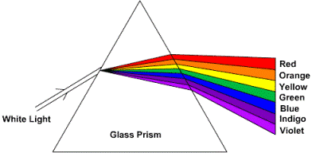

In the late 1800s, physicists were making accurate measurements of the spectra of the emissions from black bodies (objects which are opaque, or highly absorbing, to the light they emit). Good examples of black bodies are the sun, the filament of an incandescent lamp and the burner of an electric stove. The colour of a black body depends on its temperature: A cool body emitting radiation of long wavelengths, i.e., in the radio frequency range or in the infrared which are invisible to the eye, a warmer body emitting radiation which includes shorter wavelengths and appearing deep red, a still warmer body emitting radiation which includes still shorter wavelengths and appearing yellow, and a hot body emitting even shorter wavelengths and appearing white. The emissions are always over a broad range of colours, or wavelengths, and their appearance is the net result of seeing all of the colours at once. Examples of various blackbody spectra are shown below. [Computer simulations](https://phet.colorado.edu/en/simulation/blackbody-spectrum).

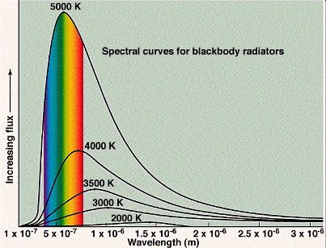

:::tip Question
According to the above definition, is your body a black body? Note: The human body can be seen in pitch darkness with thermal imaging goggles.
:::

Classical physics could not explain the spectra of black bodies. It predicted that the intensity (power emitted at a given wavelength) of emitted light should increase rapidly with decreasing wavelength without limit (the ‘ultraviolet catastrophe’). In the figure below, the curve labelled ‘Rayleigh-Jeans law’ shows the classically expected behaviour.

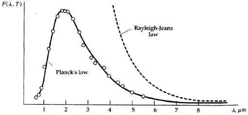

However, the measured spectra actually showed an intensity maximum at a particular wavelength, while the intensity decreased at wavelengths both above and below the maximum. In order to explain the spectra, in 1900 the German physicist Max Planck (1858–1947) was forced to make a desperate assumption for which he had no physical explanation. As with classical physics, he assumed the body consisted of vibrating oscillators (which were actually collections of atoms or molecules). However, in contrast to classical physics, which assumed that each oscillator could absorb an arbitrary amount of energy from the radiation or emit an arbitrary amount of energy to it, Planck was forced to assume that each oscillator could receive or emit only discrete, quantised energies (E), such that

E = hf&emsp;(Planck’s formula)

where *h* (Planck’s constant) is an exceedingly small number whose value we do not need here, and *f* is the frequency of vibration of the oscillator (the number of times it vibrates per second). Each oscillator is assumed to vibrate only at a fixed frequency (although different oscillators in general had different frequencies), so if it emitted some radiation, it would lose energy equal to hf, and if it absorbed some radiation, it would gain energy equal to hf. Planck did not understand how this could be, he merely made this empirical assumption in order to explain the spectra. The figure above shows Planck’s prediction; this agreed with the measured spectra.

Also in the late 1800s, experimental physicists were measuring the emission of electrons from metallic objects when they shined light on the object. This is called the photo-electric effect. These experiments also could not be explained using classical concepts. These physicists observed that emission of electrons occurred only for light wavelengths shorter than a certain threshold value that depended on the metal. Classically, however, one expected that the emission should not depend on wavelength at all, but only on intensity, with greater intensities yielding more copious emission of electrons. [Computer simulation of the photo-electric effect](https://phet.colorado.edu/en/simulation/legacy/photoelectric) The diagram below illustrates the effect.

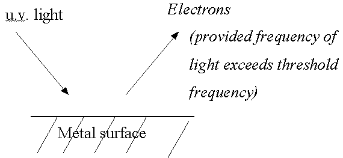

In one of a famous series of papers in 1905, Einstein explained the photo-electric effect by starting with Planck’s concept of quantised energy exchanges with light radiation, and making the startling assumption that these quantised exchanges were a direct result of the quantisation of light itself, i.e. light consisted of discrete bundles of energy called photons, rather than the continuous waves that had always been assumed in classical physics. However, these bundles still had a wave nature, and could be characterised by a wavelength, which determined their colour. He also used Planck’s relationship between energy and frequency (E = hf) to identify the energy of the photon, and he used the relationship between velocity, frequency and wavelength that classical physics had always used (v = lf, where now v = c = velocity of light). Einstein received the Nobel Prize for this paper (not for his theories of relativity!).

In classical physics, the electro-magnetic field connects charged particles to each other (see [Section 2.4](/chapter-2-classical-physics-newton-einstein/#_2-4-electromagnetism), [Section 2.6](/chapter-2-classical-physics-newton-einstein/#_2-6-relativity)). In quantum physics, the force fields of classical physics are quantised, and the quanta of the fields then become the force carriers. For example, photons are the quanta of the electro-magnetic field. In quantum physics, it is the photons that connect charged particles to each other.

## 3.2. The development of quantum mechanics by Bohr, Heisenberg, de Broglie and Schrödinger

In addition to measuring the spectra of blackbody radiation in the nineteenth century, experimental physicists also were familiar with the spectra emitted by gases through which an electrical discharge (an electric current with enough energy to strip some of the electrons from the atoms of the gas) was passing. Examples of such discharges are the familiar neon sign, in which the gas is neon; and the fluorescent light bulb, in which the gas is mercury vapour (the fluorescent light bulb has special coatings on the inner walls which change the spectrum of the light). The spectra of such light sources consist of emissions at discrete, separated wavelengths, rather than over a continuous band of wavelengths as in blackbody spectra. These spectra are called line spectra because of their appearance when they are viewed with a spectrometer (see [Section 3.1](./#_3-1-the-beginning-of-quantum-physics-by-planck-and-einstein) and figure below). [A simulation applet of line spectra](https://www.edumedia-sciences.com/en/media/661-emission-and-absorption-spectra).

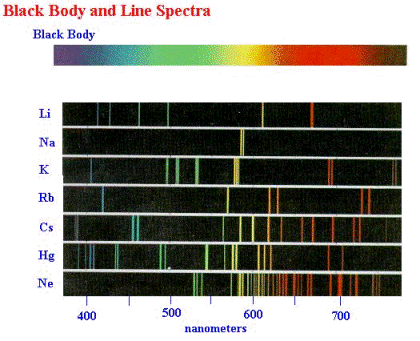

Line spectra are another example of phenomena that could not be explained by classical physics. Indeed, the explanation could not come until developments in the understanding of the structure of atoms had been made by New Zealander physicist Ernest Rutherford (1871–1937) and co-workers in 1911. By scattering alpha particles (i.e., helium nucleï, which consist of two protons and two neutrons bound together) from thin gold foils, they discovered that the gold atom consisted of a tiny (10^-15^ metres) very dense, positively charged nucleus surrounded by a much larger (10^-10^ metres) cloud of negatively charged electrons, see figure below. (Quantum mechanically, this picture is not correct, but for now it is adequate.)

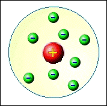

When classical physics was applied to such a model of the atom, it predicted that the electrons could not remain in stable orbits about the nucleus, but would radiate away all of their energy and fall into the nucleus, much as an earth satellite falls into the earth when it loses its kinetic energy due to atmospheric friction. In 1913, after Danish physicist Niels Bohr (1885–1962) had learned of these results, he constructed a model of the atom that made use of the quantum ideas of Planck and Einstein. He proposed that the electrons occupied discrete stable orbits without radiating their energy. The discreteness was a result of the quantisation of the orbits, with each orbit corresponding to a specific quantised energy for the electron. The electron was required to have a certain minimum quantum of energy corresponding to a smallest orbit; thus, the quantum rules did not permit the electron to fall into the nucleus. However, an electron could jump from a higher orbit to a lower orbit and emit a photon in the process. The energy of the photon could take on only the value corresponding to the difference between the energy of the electron in the higher and lower orbits. An electron could also absorb a photon and jump from a lower orbit to a higher orbit if the photon energy equalled the difference in orbit energies, see figure below. [Computer animations](https://phet.colorado.edu/en/simulation/hydrogen-atom) of the Bohr model of photon emission and absorption in the hydrogen atom.

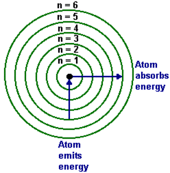

Bohr applied his theory to the simplest atom, the hydrogen atom, which consists of one electron orbiting a nucleus of one proton. The theory explained many of the properties of the observed line spectrum of hydrogen, but could not explain the next more complicated atom, that of helium, which has two electrons. Nevertheless, the theory contained the basic idea of quantised orbits, which was retained in the more correct theories that came later.

In the earliest days of the development of quantum theory, physicists, such as Bohr, tried to create physical pictures of the atom in the same way they had always created physical pictures in classical physics. However, although Bohr developed his initial model of the hydrogen atom by using an easily visualised model, it had features that were not understood, and it could not explain the more complicated two-electron atom. The theoretical breakthroughs came when some German physicists who were highly sophisticated mathematically, Werner Heisenberg (1901–1976), Max Born (1882–1970) and Pascual Jordan (1902–1980), largely abandoned physical pictures and created purely mathematical theories that explained the detailed features of the hydrogen spectrum in terms of the energy levels and the intensities of the radiative transitions from one level to another. The key feature of these theories was the use of **matrices**^[A matrix is an array of numbers that obeys rules of multiplication that are different from the rules obeyed by numbers.] instead of ordinary numbers to describe physical quantities such as energy, position, and momentum. 

:::details Biographical notes
During World War II, Heisenberg worked on the German nuclear energy project. Whether his role in the project was purely scientific or whether he had political motives, either to work towards its success or towards its failure, is still a matter of controversy. No such controversy exists over the role of Jordan, who joined the Nazi party as a storm trooper in 1933, and the Luftwaffe in 1939 as a weather analyst. Born, on the contrary, after being classified as a Jew by the Nazis in 1933, left Germany and took a position at the University of Cambridge, returning to Germany only after the War.
:::

The step of resorting to entirely mathematical theories that are not based on physical pictures was a radical departure in the early days of quantum theory, but today in developing the theories of elementary particles it is standard practice. Such theories have become so arcane that physical pictures have become difficult to create and to visualise, and they are usually developed to fit the mathematics rather than fitting the mathematics to the picture. Thus, adopting a positivist philosophy would prevent progress in developing models of reality, and the models that are intuited are more mathematical than physical.

Nevertheless, in the early 1920s some physicists continued to think in terms of physical rather than mathematical models. In 1923, French physicist Louis de Broglie (1892–1987) reasoned that if light could behave like particles, then particles such as electrons could behave like waves, and he deduced the formula for the wavelength of the waves:

λ = h ÷ p

where *p* is the momentum (mass × velocity) of the electron. Experiments subsequently verified that electrons actually do behave like waves in experiments that are designed to reveal wave nature. We will say more about such experiments in [Chapter 4](/chapter-4-waves-interference/). [A computer demonstration of de Broglie waves](http://www.colorado.edu/physics/2000/index.pl) (Table of Contents→Science Trek→de Broglie’s atom).

In physics, if there is a wave, there must be an equation that describes how the wave propagates in time. De Broglie did not find it, but in 1926 Austrian–Irish physicist Erwin Schrödinger (1887–1961) discovered the celebrated equation that bears his name. The Schrödinger equation allows us to calculate precisely the Schrödinger wave at all points in space at any future time if we know the wave at all points in space at some initial time. In this sense, even quantum theory is completely deterministic.

Schrödinger verified his equation by using it to calculate the line emission spectrum from hydrogen, which he could do without really understanding the significance of the waves. In fact, Schrödinger misinterpreted the waves and thought they represented the electrons themselves, see figure below. However, such an interpretation could not explain why experiments always showed that the photons emitted by an atom were emitted at random rather than predictable times, even though the average rate of emission could be predicted from both Heisenberg’s and Schrödinger’s theories. It also could not explain why, when an electron is detected, it always has a well-defined position in space, rather than being spread out over space like a wave.

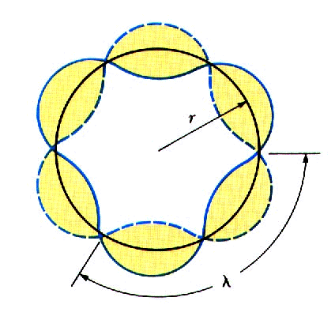

The proper interpretation was discovered by German physicist Max Born (1882–1970) in 1926, who suggested that the wave (actually, the absolute value squared of the amplitude or height of the wave, at each point in space) represents the **probability** that the electron will appear at that specified point in space **if an experiment is done to measure the location of the electron**. Thus, the Schrödinger wave is a probability wave, not a wave that carries force, energy and momentum like the electro-magnetic wave. Born’s interpretation introduces two extremely important features of quantum mechanics:

**1) From the wave, we can calculate only probabilities, not certainties (the theory is probabilistic, not deterministic).**

**2) The wave only tells us the probability of finding something if we look, not what is there if we do not look. Quantum theory is not a theory of objectively real matter (although Born thought the Schrödinger wave was objectively real).**

:::tip Questions
Suppose you accepted the principle that reality is probabilistic rather than deterministic. How would it affect your notions of free will? How would it affect your sense of control over your thoughts, feelings, decisions and actions? How would it affect your perceptions of other people’s control over their thoughts, feelings, decisions and actions? How would it affect your judgements about yourself and others?
:::

The first feature violates the second fundamental assumption of classical physics (see [Section 2.2](/chapter-2-classical-physics-newton-einstein/#_2-2-newtons-laws-and-determinism)), i.e., that both the position and velocity of an object can be measured with no limits on their precision except for those of the measuring instruments. The second feature violates the first fundamental assumption of classical physics, i.e., that the objective world exists independently of any observations that are made on it.

## 3.3. A striking example of probability measurement

Probabilities can be measured using sophisticated instrumentation. A striking example is shown in the following diagram, measured with a scanning tunnelling microscope, of the probabilities of the locations of 48 iron atoms circling the probabilities of the locations of a sea of electrons:^[[IBM celebrates 20th anniversary of moving atoms](https://phys.org/news/2009-09-ibm-celebrates-20th-anniversary-atoms.html)] 

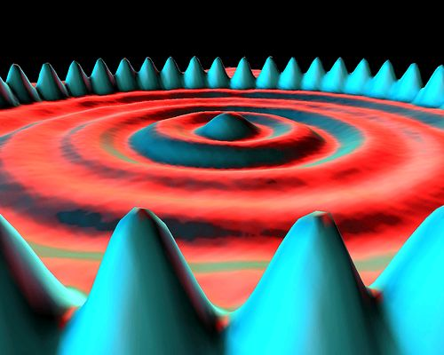

The terms ‘iron atom’ and ‘electron’ are heuristic attempts to give names to the locations. However, this diagram in no way proves that there are in reality such things as iron atoms and electrons. There is no way to prove that (see [Section 1.1](/chapter-1-three-major-metaphysical-philosophies/#_1-1-the-assumption-of-objective-reality-a-necessity-for-survival-and-for-science)), but, by giving them names, we tend to be convinced that the objects actually exist.

The probability measurements are represented by points so densely packed that they appear to form surfaces rather than individual measurements. The ‘iron atoms’ are seen to be most probably located under the blue peaks while the ‘electrons’ are seen to be more diffusely located under the circular rings. These are probability measurements of locations only, not actual locations.

## 3.4. Uncertainty and complementarity

As Born proposed, quantum theory is intrinsically probabilistic in that in most cases it cannot predict the results of individual observations. However, it is deterministic in that it can exactly predict the **probabilities** that specific results will be obtained. Another way to say this is that it can predict exactly the **average** values of measured quantities, like position, velocity, energy or number of electrons detected per unit time in a beam of electrons, when a large number of measurements are made on identical electron beams. It cannot predict the results of a single measurement. This randomness is not a fault of the theory — it is an intrinsic property of nature. Nature is not deterministic in the terms thought of in classical physics.

Another feature of the quantum world, the world of microscopic objects, is that it is intrinsically impossible to measure simultaneously both the exact position and momentum of a particle. This is the famous uncertainty principle of Heisenberg, who derived it using the multiplication rules for the matrices that he used for position and momentum. For example, an apparatus designed to measure the position of an electron with a certain accuracy is shown in the following diagram. The hole in the wall ensures that the positions of the electrons as they pass through the hole are within the hole, not outside of it.

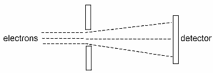

So far, this is not different from classical physics. However, quantum theory says that if we know the position q of the electron to within an accuracy of Δq (the diameter of the hole), then our knowledge of the momentum *p* (= mass × velocity) at that point is limited to an accuracy Δp such that

(Δp)(Δq) > h&emsp;(Heisenberg uncertainty relation).

In other words, the more accurately we know the position of the electron (the smaller Δq is), the less accurately we know the momentum (the larger Δp is). Since momentum is mass times velocity, the uncertainty in momentum is equivalent to an uncertainty in velocity. The uncertainty in velocity is in the same direction as the uncertainty in position. In the drawing above, the uncertainty in position is a vertical uncertainty. This means that the uncertainty in velocity is also a vertical uncertainty. This is represented by the lines diverging (by an uncertain amount) after the electrons emerge from the hole (uncertain vertical position) rather than remaining parallel as they are on the left.

Likewise, an experiment designed to measure momentum with a certain accuracy will not be able to locate the position of the particle with better accuracy than the uncertainty relationship allows.

Notice that in the uncertainty relationship, if the right side equals zero, then both Δp and Δq can also be zero. This is the assumption of classical physics, which says that if the particles follow parallel trajectories on the left, they will not be disturbed by the hole, and they will follow parallel trajectories on the right.

If we divide both sides of the uncertainty relation by the mass m of the particle, we obtain

(Δv)(Δq) > h ÷ m

Here we see that the uncertainties in velocity *v* or position *q* are inversely proportional to the mass of the particle. Hence, one way to make the right side effectively zero is to make the mass very large. When numbers are put into this relationship, it turns out that the uncertainties are significant when the mass is microscopic, but for a macroscopic mass the uncertainty is unmeasurably small. Thus, classical physics, which always dealt with macroscopic objects, was close to being correct in assuming that the position and velocity of all objects could be determined arbitrarily accurately.

The uncertainty principle can be understood from a wave picture. A wave of precisely determined momentum corresponds to an infinitely long train of waves, all with the same wavelength, as is shown in the first of the two wave patterns below. This wave is spread over all space, so its location is indeterminate.

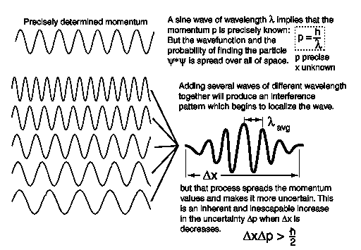

A wave of less precisely determined momentum can be obtained by superposing (see [Section 4.1](/chapter-4-waves-interference/#_4-1-waves-and-interference)) waves of slightly different wavelength (and therefore slightly different momentum) together, as is shown in the second of the two patterns above. This results in a wave packet with a momentum spread Δp (uncertainty Δp), but which is bunched together into a region of width Δx (uncertainty Δx) instead of being spread over all space.

The uncertainty relation is closely related to the complementarity principle, which was first enunciated by Bohr. This principle states that quantum objects (objects represented by quantum wave-functions) have both a particle and a wave nature, and an attempt to measure precisely a particle property will tend to leave the wave property undefined, while an attempt to measure precisely a wave property will tend to leave the particle property undefined. In other words, particle properties and wave properties are complementary properties. Examples of particle properties are momentum and position. Examples of wave properties are wavelength and frequency. A precise measurement of momentum or position leaves wavelength or frequency undefined, and a precise measurement of wavelength or frequency leaves momentum or position undefined.

:::tip Question
Suppose the complementarity principle is extended to macroscopic objects. For example, if your intent is to see a water wave, you see a water wave but not a water particle. If your intent is to see a water particle, you see a water particle but not a water wave. In other words, you see only what you intend to see. Can you think of any similar examples of this principle in your daily life?
:::

We have seen that, even if the quantum wave function is objectively real, it is a probability wave, not a physical wave. Furthermore, complementarity and uncertainty strongly imply that the electron (or any other ‘particle’) exists neither as a physical particle nor a physical wave. But, if so, in what form does it exist? So far, we have neglected the role of the observer in all measurements. When we take the observer into account (see [Chapter 6](/chapter-6-what-does-quantum-theory-mean/)), we shall see that quantum theory does not require physical particles or waves (see also [Section 1.1](/chapter-1-three-major-metaphysical-philosophies/#_1-1-the-assumption-of-objective-reality-a-necessity-for-survival-and-for-science)), but it does require observations! We explore this provocative statement much further in later chapters.

---

#### Footnotes